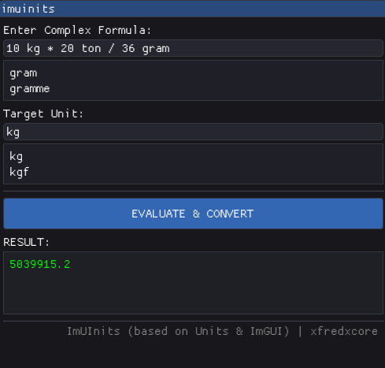

# imuinits

A fast, lightweight, and flexible multi-step unit converter built with **Dear ImGui**, **GLFW**, and **OpenGL3**, powered by the robust **GNU Units** engine under the hood.

## Features
* **Multi-step Calculations:** Evaluate complex formulas like `10 meter / 2 meter * 30 footballfield`.
* **Dynamic Autocomplete:** Predictive input hints that instantly parse and match your text against the GNU Units database on the fly.
* **Zero External Dependencies for Fonts:** Uses the highly optimized default font system.
* **Modern Dark Theme:** Clean, scannable UI designed for engineers.

## Requirements
* `units`
* `glfw`
* `opengl`
* `g++` compiler

## Installation & Compilation
Clone the repository and compile using g++
